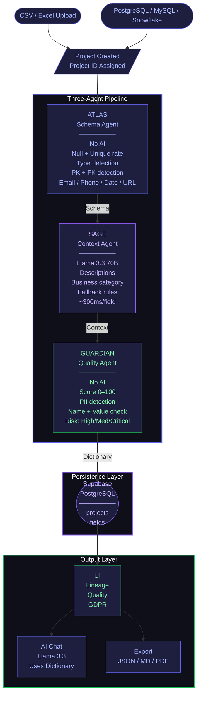

# DataSense AI

DataSense AI turns any undocumented CSV or database into a fully documented, business-ready data dictionary in under 30 seconds. A three-agent AI pipeline automatically analyzes every column, generates plain-English descriptions, scores data quality, detects personally identifiable information, and flags GDPR compliance risks — with zero configuration and zero manual input.

## The Problem

Every company has data. Almost none of it is documented. A new analyst joins and gets handed a 200-column database with column names like `cust_flg_2`, `txn_ref_id`, and `is_active_v3`. Nobody outside the original engineer knows what these mean. Compliance teams have no visibility into which fields contain personal data — a GDPR violation waiting to happen. Enterprise tools like Collibra solve this. They charge $100,000 a year and take weeks to implement.

DataSense AI solves it in 30 seconds. For any team. At any scale.

## How It Works

DataSense runs a three-agent pipeline the moment you upload a file. Each agent is specialized for one job and hands its output to the next.

### Atlas — Schema Analysis Agent

Atlas is entirely deterministic. It makes zero AI or API calls — it uses pure mathematics and regex-based parsing.

- Reads every column and iterates every value
- Calculates null rate and unique rate per column
- Samples the first five non-null values per field
- Infers data types: integer, decimal, boolean, datetime, email, string
- Detects primary keys: fields named `id` or ending in `_id` with 100% uniqueness and 0% nulls
- Detects foreign keys: fields ending in `_id` that do not meet primary key criteria
- Identifies patterns: email format, phone format, ISO dates, URLs, categorical fields
- Passes enriched schema to Sage

Because Atlas uses no language model, it is instantaneous, costs nothing to run, and is 100% accurate on structural analysis.

### Sage — Business Context Agent

Sage calls Groq's inference API running Meta's Llama 3.3 70B parameter model to generate human-readable context for every field.

- Receives the enriched field list from Atlas
- For each field, sends a structured prompt containing: field name, detected type, sample values, and filename
- Receives a JSON response containing a plain-English description and a business category
- Business categories: identifier, contact, financial, temporal, status, demographic, behavioral, other
- Falls back to rule-based descriptions if the API is unavailable — the pipeline never breaks
- Respects API rate limits with 300ms spacing between calls

Groq's custom LPU (Language Processing Unit) hardware delivers inference significantly faster than GPU-based providers. Each description returns in under 300 milliseconds. Llama 3.3 70B was chosen specifically because smaller models produce generic output. At 70 billion parameters, the model generates descriptions like "The total monetary value of all purchases made by a customer across their account lifetime" rather than "this field contains data."

### Guardian — Quality and Compliance Agent

Guardian is deterministic like Atlas — no language model. Compliance decisions must be exact, not probabilistic.

**Quality Scoring**

Every field starts at 100 and deductions are applied:

- Null rate above 50% — minus 30
- Null rate above 20% — minus 20
- Null rate above 5% — minus 10
- Low uniqueness on non-categorical fields — minus 10
- Unknown data type — minus 20
- Missing description — minus 15
- Primary key detected — plus 5 bonus

Scores map to statuses: 85-100 is Approved, 60-84 is Pending, below 60 is Rejected.

**PII Detection**

Guardian checks 11 PII categories against every field: Email, Phone, SSN, Date of Birth, First Name, Last Name, Address, Postal Code, Credit Card, IP Address, Passport.

Detection uses dual validation — the field name must match a known pattern AND the actual values must match a regex pattern. This eliminates false positives. Each detected PII field is assigned a GDPR risk level per Article 9: Critical (SSN, Credit Card, Passport), High (Email, Phone, Date of Birth, Address), or Medium (Names, Postal Code, IP Address).

## Features

**Data Dictionary Generation**
- Plain-English business descriptions for every column
- Data type detection across six types
- Primary and foreign key identification
- Sample value extraction
- Field-level approve, edit, and reject controls
- Filter by type, status, or search by name and description

**Quality Intelligence**
- Explainable quality scores from 0 to 100
- Hover-over confidence tooltips showing exactly how each score was calculated
- Issue detection with field-level warnings for high null rates and data anomalies
- Dataset summary with instant breakdown of types, averages, and problem fields

**GDPR and Compliance**
- Automatic PII detection across 11 categories
- GDPR risk level assignment — Critical, High, Medium
- Compliance banner that fires automatically when PII is detected
- Zero configuration required

**Field Lineage Graph**
- Interactive force-directed graph of all columns and their relationships
- Gold nodes for primary keys, purple nodes for foreign keys with directional arrows, red nodes for PII fields
- Click any node to open the full field detail panel
- Auto-generated from Atlas structural analysis

**AI Chat Assistant**
- Natural language interface over your specific dictionary
- The complete dictionary is passed as structured context in the system prompt
- Knows your exact column names, types, quality scores, and PII flags
- Generates SQL using real column names from your file
- Context is rebuilt from Supabase if the user returns in a later session

**Export**
- Export to JSON, Markdown, or PDF in one click
- JSON includes full PII metadata for downstream compliance tooling
- Markdown suitable for documentation wikis and README files
- PDF formatted for print and audit sharing

**Database Connections**
- CSV and Excel file upload up to 50MB
- PostgreSQL, MySQL, and Snowflake connection support
- Pipeline is identical regardless of source — Atlas reads from information schema instead of a file

## Architecture

The pipeline is sequential and stateless. Every agent hands enriched data to the next. Full auditability is maintained through real-time terminal logging on the analysis screen.

---

## Tech Stack

| Layer | Technology |
|---|---|
| Frontend | React, Vite, Tailwind CSS, Zustand |
| Backend | Node.js, Express |
| AI Inference | Groq API, Meta Llama 3.3 70B |
| Database | Supabase (PostgreSQL) |
| Visualization | D3.js (Lineage Graph) |
| Deployment | Railway |

## Scalability

The architecture is designed to scale at each layer independently:

- **Atlas** is stateless JavaScript — multiple files can be processed in parallel with no shared state
- **Sage** uses async calls with built-in rate limiting — concurrency increases by running Groq calls in parallel batches
- **Guardian** is pure computation — moveable to a worker thread or serverless function with no code changes
- **Backend** is stateless Express — horizontal scaling behind a load balancer, with Redis as a drop-in for distributed session storage
- **Supabase** scales independently as the persistent data layer

## Data Privacy

Files are processed in a temporary directory and deleted immediately after analysis completes. Raw data is never stored. Only the generated dictionary metadata — descriptions, types, quality scores — is persisted to Supabase. Enterprise deployment can run fully on-premise.

## Comparison

| | DataSense AI | Collibra | Alation | Dataedo |
|---|---|---|---|---|
| Setup time | 30 seconds | Weeks | Weeks | Days |
| Price | Free / $49/mo | ~$100,000/year | Enterprise pricing | Manual licensing |
| PII detection | Automatic | Manual configuration | Limited | No |
| AI descriptions | Yes | No | Partial | No |
| Self-serve | Yes | Requires consultants | Requires training | Yes |

## Business Model

- **Free** — individual users, files up to 10MB
- **Pro** — $49/month per team, large files, database connections, collaboration
- **Enterprise** — Snowflake and BigQuery integration, SSO, audit trails, on-premise deployment

Built at HackFest 2.0 using the multi-agent architecture philosophy pioneered by Turgon AI for enterprise data governance — applied at the individual dataset level to make serious data documentation accessible to every analyst, engineer, and compliance team.
